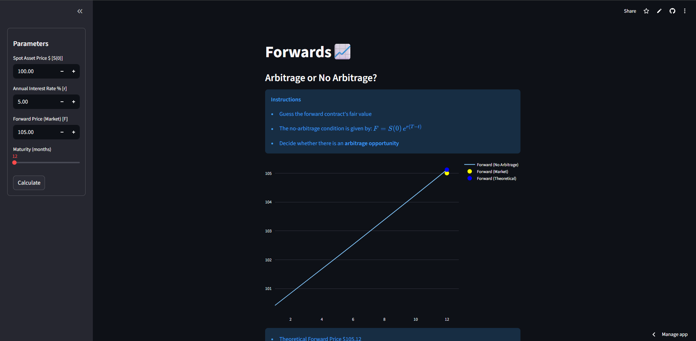

# Forwards - Arbitrage or No Arbitrage? 📈

Welcome to the Forwards app! 🎉 This Streamlit tool helps you explore forward contracts, compare market prices with fair theoretical values, and see if there’s any arbitrage opportunity. Perfect for finance enthusiasts or students wanting a hands-on way to visualize forward pricing. 💡

---

## What You Can Do 🛠️

* Calculate the **theoretical forward price** using the no-arbitrage rule:

  $$
  F = S(0) , e^{r(T-t)}
  $$

* Compare it with the **market forward price** 💰.

* Instantly detect if there’s an **arbitrage opportunity** ⚡.

* See **suggested strategies** if arbitrage exists 📋.

* Explore an **interactive chart** showing the forward curve and market vs theoretical prices 📊.

---

## Getting Started 🚀

### 1. Clone the Repo 📝

```bash
git clone https://github.com/pedromaltex/Introducao_Matematica_Financeira.git
```

### 2. Set Up a Virtual Environment (Optional but Recommended) 🖥️

```bash
python -m venv venv
source venv/bin/activate  # Linux/macOS
venv\Scripts\activate     # Windows
```

### 3. Install Dependencies 📦

```bash
cd cap1_paul_wilmott/forwards
pip install -r requirements.txt
```

### 4. Run the App ▶️

```bash
streamlit run app.py
```

Just fill in the Spot Price, Interest Rate, Market Forward Price, and Maturity, then hit **Calculate**! ✅

---

## 📷 Demo

  

---

## Tech Stack 🧰

* [Streamlit](https://streamlit.io/) for the interface 🖥️
* [Plotly](https://plotly.com/python/) for interactive charts 📊
* [NumPy](https://numpy.org/) for computations ⚙️

---

## Folder Structure 📁

```
forwards-arbitrage-app/
├─ app.py              # Main Streamlit app
├─ forward_aux.py      # Helper functions for calculations
├─ requirements.txt    # Dependencies
├─ README.md           # This file
└─ screenshots/        # Optional screenshots
```

---

## License 📝

MIT License – feel free to use and play around with it! 🎉

---

## Author 👨‍💻

Pedro Maltez – finance and coding enthusiast. Enjoy experimenting with forward contracts! 💡
