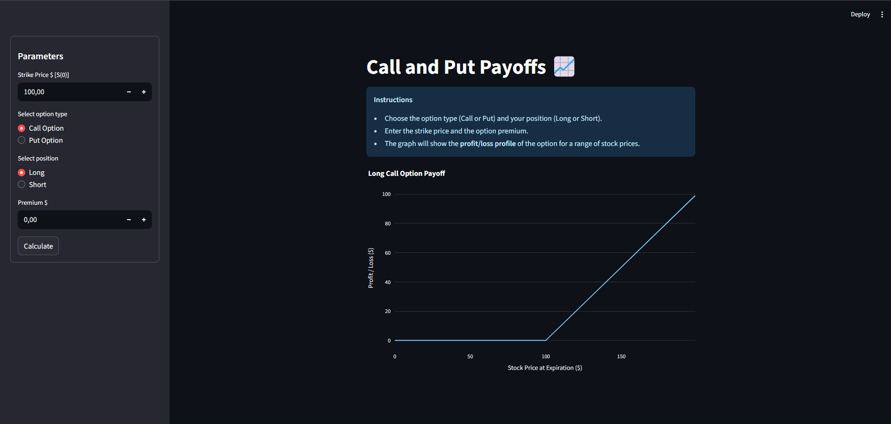

# Call and Put Payoff Viewer 📈

A friendly and interactive Streamlit app to visualize **call and put option payoffs**, including long/short positions and option premiums. Perfect for students, finance enthusiasts, or anyone learning options.

---

## Features 🛠️

* Select **Call or Put** option
* Choose **Long or Short** position
* Enter **strike price** and **premium**
* Visualize **profit/loss at expiration** for a range of stock prices
* Interactive Plotly chart with **breakeven point** highlighted
* Max and Min payoff displayed for easy analysis

---

## Installation 🚀

1. Clone the repository:

```bash
git clone https://github.com/pedromaltex/Introducao_Matematica_Financeira.git
```

2. (Optional) Create a virtual environment:

```bash
python -m venv venv
source venv/bin/activate  # Linux/macOS
venv\Scripts\activate     # Windows
cd cap2_paul_wilmott\call_put_options

```

3. Install dependencies:

```bash
pip install -r requirements.txt
```

---

## Usage ▶️

Run the app:

```bash
streamlit run app.py
```

* Fill in the **strike price** and **premium**.
* Select **option type** and **position**.
* Click **Calculate** to see the interactive payoff chart.
* Hover over the chart to see **profit/loss** at specific stock prices.

---

## Example Screenshot 📸



---

## Folder Structure 📁

```
call-put-payoff-app/
├─ app.py              # Main Streamlit app
├─ call_put_aux.py     # Option payoff helper functions
├─ requirements.txt    # Dependencies
├─ README.md           # This file
└─ screenshots/        # Example screenshots (optional)
```

---

## Tech Stack 🧰

* [Streamlit](https://streamlit.io/) – Web interface
* [Plotly](https://plotly.com/python/) – Interactive charts
* [NumPy](https://numpy.org/) – Numerical computations

---

## License 📝

MIT License – free to use, modify, and share!

---

## Author 👨‍💻

Pedro Maltez– finance and coding enthusiast. Learn and experiment with option payoffs in a visual way!
