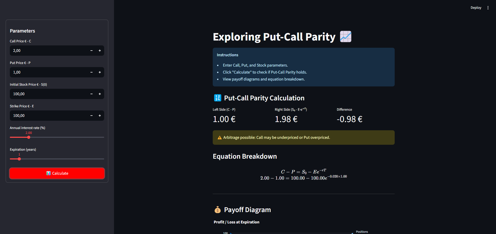

# ⚖️💸 Put-Call Parity Visualizer

A fun and interactive **Streamlit app** to explore and understand the beautiful relationship between **call and put options** — the **Put-Call Parity**!  
Perfect for **finance students**, **investors**, and **curious learners** who want to *see* how option prices balance out in real markets. 📊

---

## 🌟 Features

✨ **Dynamic Equation Viewer**
- See both sides of the classic formula:
  \[ C - P = S_0 - E e^{-rT} \]
- Real-time calculation and comparison between both sides.

🧮 **Instant Insights**
- Displays **Left Side (C − P)**, **Right Side (S₀ − E·e⁻ʳᵀ)**, and the **Difference**.  
- Detects **arbitrage opportunities** automatically ⚠️

📈 **Interactive Payoff Charts**
- Visualize **Long Call + Short Put** and **Short Call + Long Put** payoffs.  
- Hover to see exact profit/loss values.  
- Includes a zero-profit line for quick interpretation.

💡 **Educational Design**
- Perfect for class demos or self-study sessions.  
- Shows live LaTeX-formatted equations with your inputs!

---

## 🚀 Installation

1. Clone this repository:

```bash
git clone https://github.com/pedromaltex/Introducao_Matematica_Financeira.git
```

2. (Optional) Create and activate a virtual environment:

```bash
python -m venv venv
source venv/bin/activate  # Linux/macOS
venv\Scripts\activate   # Windows
cd cap2_paul_wilmott
cd put_call_parity
```

3. Install the required dependencies:

```bash
pip install -r requirements.txt
```

---

## ▶️ How to Use

1. Run the app locally:

```bash
streamlit run app.py
```

2. Fill in the sidebar with:
   - 💰 Call and Put prices  
   - 📊 Stock price  
   - 🎯 Strike price  
   - 🕓 Time to expiration  
   - 📉 Interest rate  

3. Click **"📊 Calculate"** and watch the magic happen!  
   - The app will calculate both sides of the equation.  
   - Show whether parity **holds or not**.  
   - Display beautiful payoff charts for deeper insight.

---

## 📸 Example Screenshot



---

## 📁 Folder Structure

```
put_call_parity/
├─ app.py              # Main Streamlit app
├─ options.py          # Option payoff helper functions
├─ requirements.txt    # Dependencies
├─ README.md           # This file
└─ screenshots/        # Example screenshots (optional)
```

---

## 🧰 Tech Stack

- 🖥️ [Streamlit](https://streamlit.io/) — Web interface  
- 📊 [Plotly](https://plotly.com/python/) — Interactive charts  
- 🧮 [NumPy](https://numpy.org/) — Numerical computations  

---

## 🎓 Learn the Concept

**Put-Call Parity** is a cornerstone of options pricing theory:  
it ensures that the prices of call and put options remain **consistent** and **free from arbitrage**.  

With this app, you can experiment, learn, and visualize how the equation behaves under different parameters. 🤓

---

## 🧑‍💻 Author

Created with ❤️ by **Pedro Maltez** — a passionate explorer of finance, coding, and education.  
If you find this project helpful, ⭐️ the repo and keep learning! 🚀
